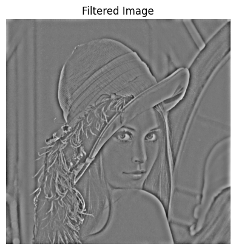

# Image and Video Processing Laboratory | EC69211
**Submission By:** Irsh Vijay (21EC39055)

### How to Run:
Helper codes can be found in `fft_utils.py`. To try run `exp4.ipynb` directly.

The code contains the `FFT` and `Experiment4` class which can be used making & visualising FFTs and filtering in Frequency Domain respectively.

### Results:
#### Q1:

Ideal LPF:  

   
<tr> 
 </tr>   

Ideal HPF:  

  
 
<tr> 
 </tr>   

Gaussian LPF:  

   
<tr> 
 </tr>  

Gaussian HPF:  

   
<tr> 
 </tr>  

Butter LPF:  

   
<tr> 
 </tr>  

Butter HPF:  

   
<tr> 
 </tr>  

#### Q2:
The leopard_elephant image is an optical illusion which shows an elephant when viewed at low resolution and a leopard at higher resolution.

  

We "hybridize" images of Albert Einstein and Marilyn Monroe.

<tr>   </tr>  

Hybridizing!

  

Then viewing at different resolutions: 

  

#### Q3:
We have two noisy images:  

<tr>   </tr>  

Both of them have some kind of sinusoidal grating as noise, we see similar noise when we take an image of a screen. (some kind of aliasing)
  
The approach I have followed is to first pass the image through LPF and retain its content and then subtract the sinusoidal grating then add back the LPFed Image.

  
  

Similar approach can be followed for `cameraman_noisy2.jpg`

  
 

We can also have something like:

  
   
  
 

