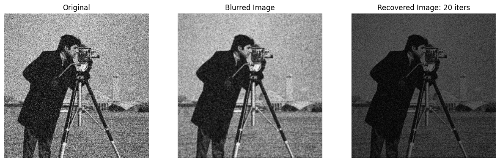

# Image and Video Processing Laboratory | EC69211
**Submission By:** Irsh Vijay (21EC39055)

### How to Run:
To try run `exp5.ipynb` directly.

The code contains the `ImageStack` class along with an UI which can be used for spatial domain filtering (convolutions).

### Effects of different filters:
* Mean:
 
</img>
* Median:
 
</img>
* Prewitt X:
 
</img>
* Prewitt Y:
 
</img>
* Sobel X:
 
</img>
* Sobel Y:
 
</img>
* Laplacian:
 
</img>
* Gaussian:
 
</img>
* Laplacian of Gaussian:
 
</img>

### Gaussian Unblur:
 
</img>