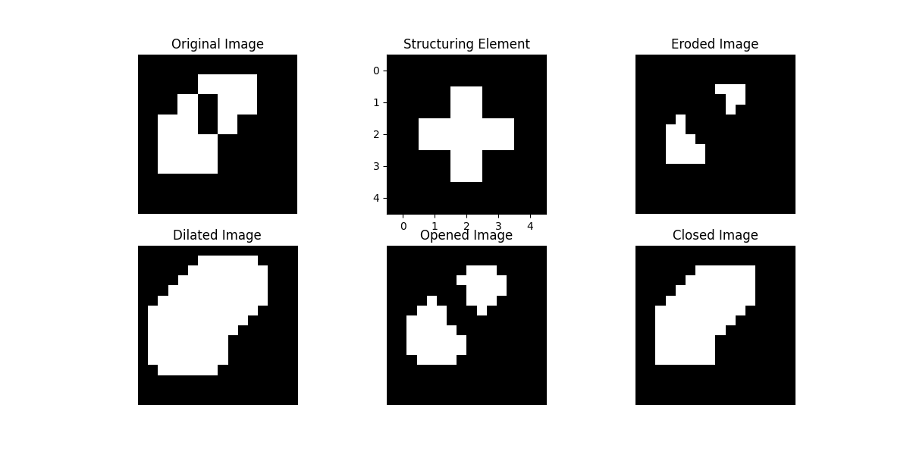
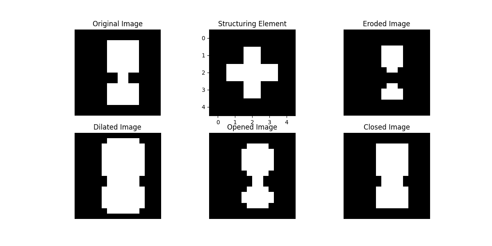

# Image and Video Processing Laboratory | EC69211 | Experiment - 7
**Submission By:** Irsh Vijay (21EC39055)

### How to Run:
To try run `exp7.py` and modify filepath:

Setup:
```shell
pip install -r requirements.txt
```

Run:
```shell
python exp7.py -f 'path/to/image.bmp'
```
and then choose structuring element. 

Python Usage:
```python
B = np.array([[0, 1, 0], [1, 1, 1], [0, 1, 0]])
A = Exp7Image(filepath="path/to/image.bmp") # or A = Exp7Image(data=np.array())

A.erode(B) # can use erode, dilate, open, close
```

Precomputed outputs are saved to `output/`.

</img>

</img>

### Code Structure:
- `exp7.py`: Contains `Exp7Image` class with erode, dilate, open and close methods.