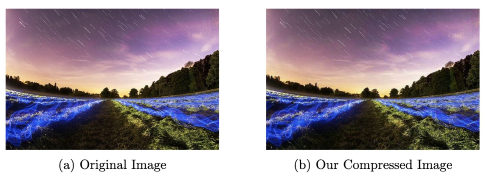

# Image and Video Processing Laboratory | EC69211 | Mini-Project
**Submission By:** Irsh Vijay (21EC39055) and Aditya Raj (21EC39001)

### How to Run:

Setup:
```shell
pip install -r requirements.txt
```

Run:
```python
from src.jpeg.compress import ImageCompressor

ic = ImageCompressor(quality_factor=50, subsampling='4:2:0', verbose=True)

raw_bytes = ic.compress(img)
ic.save(output_filepath, raw_bytes)
print(f"Compressed by {1 - os.path.getsize(output_filepath) / os.path.getsize(input_filepath):.2%}")

ic.decompress(raw_bytes)
```

